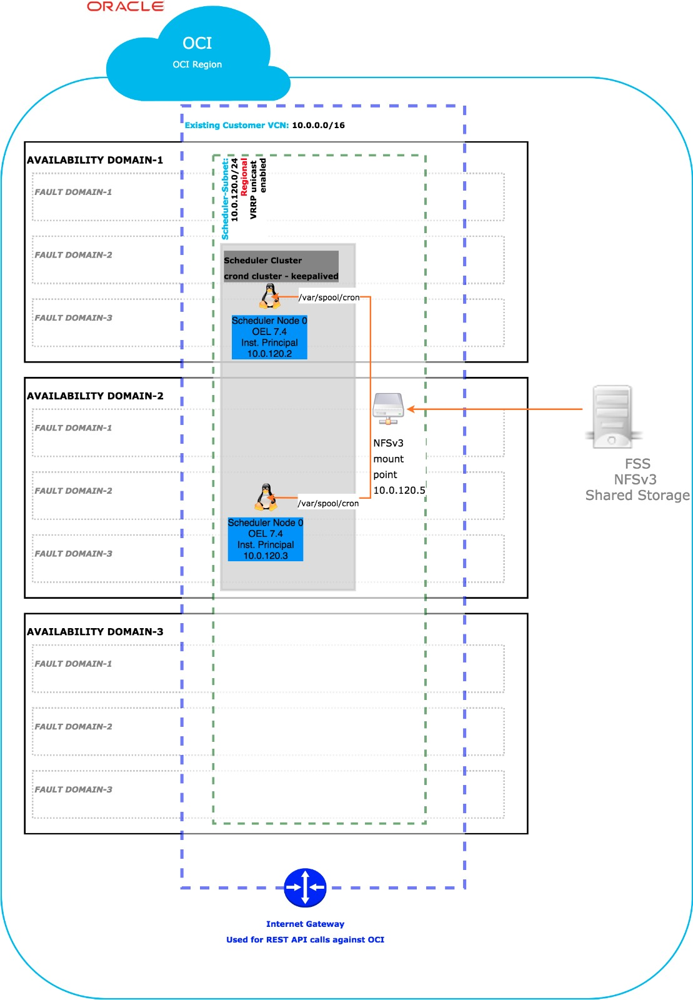

# Oracle Cloud Infrastructure (OCI) Automation for Terraform to configure an HA scheduler

## Introduction

This document describes the architecture, the implementation steps and automation for provisioning an HA scheduler on OCI. 

## Solution
The automation for Terraform provisions and configures the following:

- ***Networking:***
  - inside a given VCN it provisions a subnet.
  - It creates the needed security lists that is adding the following:
    - sec rules to allow ssh connectivity to the scheduler nodes
    - sec rules to allow the scheduler nodes to mount an NFS share from FSS
    - sec rules to allow keepalived to run VRRP in unicast mode
  - it creates the necessary routes to the Internet Gateway to allow the
scheduler(crontab) to make REST API calls against the OCI REST API

- ***Storage:***
  - File Storage Service:
    - It creates an FSS instance and a mount point on the subnet above that will be mounted on the scheduler nodes under /var/spool/cron in order to be used by the crontab clustering feature.
  - Additional Block Volumes
  - One Volume Group per each AD that will contain all boot and block volumes of the scheduler nodes in that AD

- ***IAM:***
  - For running REST API calls from within the scheduler nodes we'll authenticate against the OCI console by using Instance Principals. For this purpose, we'll create the following:
    - A Dynamic Group that will contain custom scheduler instances OCIDs
    - A Policy that will allow the Dynamic Group above to manage the needed OCI artifacts.

- ***Compute:***
  - **Provisioning:**
    - It will provision the given number of custom scheduler cluster nodes.
    - The nodes will be attached to the subnet above.
    - The nodes will also have a public NAT IP.
  - **Configuration:**
    - Against each node the automation will run remote exec scripts to perform the following:
      - install the OCI CLI - this will be needed by the crontab to trigger, based on a scheduler, a custom OCI call
    - Install and configure cron in clustering mode 
      - Configure cron to run at the given frequency the oci cli command to trigger a backup
      - This cron job will be a singleton service running on one single crond cluster node service at a given time
      - keepalived controls which cron node is the master node - by running `crontab -n` on the master node
    - Install and configure keepalived with VRRP in unicast mode:
      - keepalived monitors the crond process running locally(pidof crond)
      - When the current master node fails, keepalived declares another available node as the new master node and calls on that node a script(`crontab -n`) to notify crond cluster which is the new master node which will be in charge of running the singleton scheduler.
    - The Scheduler nodes are configured to use the OCI NTP server.


## Prerequisites

See the Oracle Cloud Infrastructure Provider docs for information about setting up and using the Oracle Cloud Infrastructure Provider.
https://github.com/terraform-providers/terraform-provider-oci


## Getting Started

Rename Authentication parameters: `terraform.tfvars.template` to `terraform.tfvars` and update

Following commands runs the automation for Terraform:

     terraform apply -state <your-state-file>.tfstate


## Automation Inputs

### Provider
This module supports a custom provider. With a custom provider, a single project (tf) automation can manage asset provisioning across multiple tenancies or regions.

You'll manage the providers in the tf automation projects where you reference this module.

Example: 

```
provider "oci" {
  tenancy_ocid     = "${var.tenancy_id}"
  user_ocid        = "${var.user_id}"
  fingerprint      = "${var.fingerprint}"
  private_key_path = "${var.private_key_path}"
  region           = "${var.region}"
}

provider "oci" {
  alias            = "oci_home"
  tenancy_ocid     = "${var.tenancy_id}"
  user_ocid        = "${var.user_id}"
  fingerprint      = "${var.fingerprint}"
  private_key_path = "${var.private_key_path}"
  region           = [for i in data.oci_identity_region_subscriptions.this.region_subscriptions : i.region_name if i.is_home_region == true][0]
}
```
The following IAM attributes are available in the the `terraform.tfvars` file:

```
# GETTING STARTED
#
# 1. Download and install Terraform (https://www.terraform.io/downloads.html)
# 2. Download and install the OCI provider (https://github.com/oracle/terraform-provider-oci/)
# 3. Make sure that you have an OCI API key setup
#       See https://docs.us-phoenix-1.oraclecloud.com/Content/API/Concepts/apisigningkey.htm for directions on creating an API signing key
#       See https://docs.us-phoenix-1.oraclecloud.com/Content/Identity/Tasks/managingcredentials.htm on how to manage API keys in the OCI UI or API
# 4. Copy your tenancy OCID below (bottom part of OCI screen, after Tenancy OCID: heading)
# 5. Copy your OCI user account OCID (login to OCI > Identity > Users)
# 6. Copy the required API key fingerprint and private key path (below)
# 7. Fill-in the full path to the SSH public and private keys (this can be used when creating new instances)
#       See https://docs.us-phoenix-1.oraclecloud.com/Content/GSG/Tasks/creatingkeys.htm for directions on how to create this key pair
#
# HELPFUL URLs
# * https://github.com/oracle/terraform-provider-oci/blob/master/docs/Table%20of%20Contents.md
#

# RUNNING Terraform
#
# Once you've gone through the steps mentioned above, you need to populate your environment variables, by sourcing this file... steps are below:
# 1. Modify this file (so it reflects your OCIDs, etc.)
# 2. $ terraform init
#       You only have to do this once after installing or upgrading your Terraform plugins
# 3. $ terraform plan
#       This will show you what Terraform might do if you applied it
# 4. $ terraform apply

#############################
# TENANCY DETAILS
#############################

# Get this from the bottom of the OCI screen (after logging in, after Tenancy ID: heading)
tenancy_id = "<tenancy-idt>"

# Get this from OCI > Identity > Users (for your user account)
user_id = "<user-ocid>"

# the fingerprint can be gathered from your user account (OCI > Identity > Users > click your username > API Keys fingerprint (select it, copy it and paste it below))
fingerprint = "<fingerprint>"

# this is the full path on your local system to the private key used for the API key pair
private_key_path = "<private-key-path>"

# region (us-phoenix-1, ca-toronto-1, etc)
region = "eu-frankfurt-1"
```


* Additional configuration parameters are required in `ha-scheduler.auto.tfvars`:

```

#############################
# TENANCY DETAILS
#############################

# default compartment 
default_compartment_id = "<default_compartment_ocid>"

# iam compartment - if null then default_compartment_id will be used
iam_compartment_id = null

#############################
# naming convension
#############################

# the prefix that will be used for all the names of the OCI artifacts that this automation will provision
names_prefix = "oci-scheduler"

# the defined tags to be used for all the artifacts that this automation will provision
defined_tags = {}

# the freeform tags to be used for all the artifacts that this automation will provision
freeform_tags = {}

#############################
# volumes - block storage
#############################

# block storage compartment - if null then default_compartment_id will be used
block_storage_compartment_id = null

# The aditional block volumes backup policy: Bronze, Silver or Gold. Default = Bronze. Null = Bronze
volumes_backup_policy = null

# The aditional block volumes mount point
aditional_block_volume_mount_point = "/u01"

# The aditional block volumes size
aditional_block_volume_size = 55

#############################
# OCI HA Scheduler network
#############################

# The specific network compartment id. If this is null then the default, project level compartment_id will be used.
network_compartment_id = null

# the VCN id where the HA Scheduler network components will be provisioned
vcn_id = "<vcn_ocid>"

# the route table attached to the HA Scheduler subnet. Configuration supports both public internet routes and private routes
oci_ha_scheduler_route_table = {
  route_rules = [{
    # route to public internet ("0.0.0.0/0") or to private destination
    dst      = "0.0.0.0/0"
    dst_type = "CIDR_BLOCK"
    # next hop can be an Internet Gateway or other Gateway(ex. DRG)
    next_hop_id = "IG_OCID"
  }]
}

# HA Scheduler subnet DHCP options
dhcp_options = {
  oci_ha_scheduler_dhcp_option = {
    server_type        = "VcnLocalPlusInternet"
    search_domain_name = "DomainNameServer"
    forwarder_1_ip     = null
    forwarder_2_ip     = null
    forwarder_3_ip     = null
  }
}

# HA Scheduler subnet CIDR
oci_ha_scheduler_subnet_cidr = "10.0.80.0/24"

# option for having a public and private HA Scheduler or just a private HA Scheduler
assign_public_ip = true

#############################
# File System Details
#############################

# The specific FSS compartment id. If this is null then the default, project level compartment_id will be used.
fss_compartment_id = null

# The FSS configuration. If null(file_system = null) then no FSS artifacts will not be configured
file_system = {
  # the File Sytem and mount target AD - AD number
  availability_domain = 1
  export_path         = "/u02"
}

# the folder(mount point) where the FSS NFS share will be mounted
fss_mount_point = "/var/spool/cron/"

#############################
# OCI HA Scheduler Instances
#############################

# The specific compute compartment id. If this is null then the default, project level compartment_id will be used.
compute_compartment_id = null

# The number of cluster nodes to be provisioned
cluster_size = 2

# Compute instances ssh public key
ssh_public_key_path = "<public ssh key>"

# Compute instances ssh private key
ssh_private_key_path = "private ssh key"

# The name of the shape to be used for all the provisioned compute instances. The automation will automatically figure out the OCID for the specific shape name in the target region.
shape = "VM.Standard2.1"

# The name of the image to be used for all the provisioned compute instances. The automation will automatically figure out the OCID for the specific image name in the target region.
image_name = "Oracle-Linux-7.7-2019.10.19-0"


# OCI ha scheduler Config

# Scheduler crond configuration
/*
*     *     *     *     *  command to be executed
-     -     -     -     -
|     |     |     |     |
|     |     |     |     +----- day of week (0 - 6) (Sunday=0)
|     |     |     +------- month (1 - 12)
|     |     +--------- day of month (1 - 31)
|     +----------- hour (0 - 23)
+------------- min (0 - 59)
*/

# Every 3 minutes
scheduler_frequency = "*/3 * * * *"

# Custom command to be run be the crond
custom_command = "/usr/bin/oci --auth=instance_principal compute image list --compartment-id ocid1.compartment.oc1..aaaaaaaacnmuyhg2mpb3z6v6egermq47nai3jk5qaoieg3ztinqhamalealq"

#############################
# OCI HA Scheduler Util Nodes
#############################

# Option to have an util compute node provisioned or not.
provision_util_node = false
```

# Notes 
**`Regional Deployment`**



## Current limitations

* Currently the automation does ***not*** support:
  * updating the number of cluster nodes after the initial provisioning. To update the number of cluster nodes you will need to destroy and re-apply.

## URLs


For additional information see 
* https://docs.cloud.oracle.com/iaas/Content/File/Concepts/filestorageoverview.htm
* http://man7.org/linux/manpages/man8/cron.8.html#CLUSTERING_SUPPORT
* https://docs.cloud.oracle.com/iaas/Content/Compute/Tasks/configuringntpservice.htm


## Versions

This module has been developed and tested by running terraform on macOS Mojave Version 10.14.6

```
user-mac$ terraform --version
Terraform v0.12.13
+ provider.null v2.1.2
+ provider.oci v3.50.0
+ provider.random v2.2.1
+ provider.oci v3.31.0
```

## License

Copyright (c) 2020 Oracle and/or its affiliates.

Licensed under the Universal Permissive License 1.0.

See [LICENSE](LICENSE) for more details.
